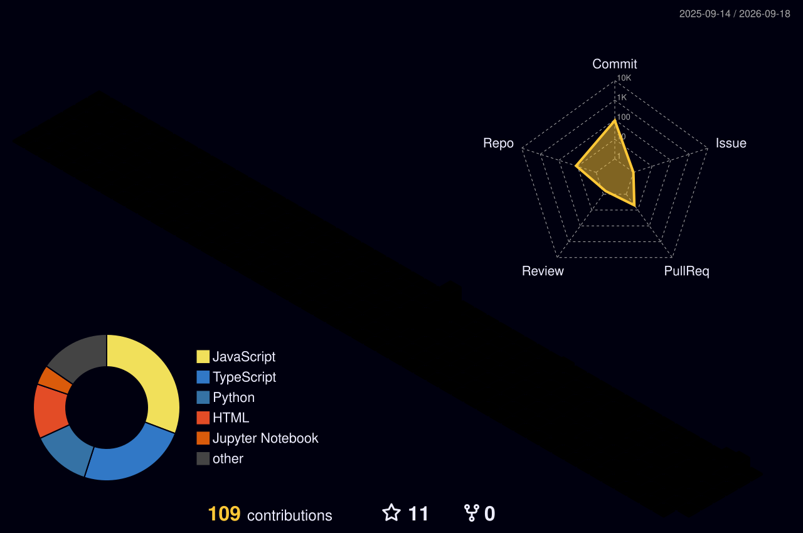

<p align="center">
  
</p>
</p>
<div align="center">
  
</div>
<p align="center">
  
</p>
<p align="center">
  
</p>

<br>

### Things I made when "just trying something" got out of hand

<table>
<tr>
<td width="50%" valign="top">

### Awaaj

A privacy-focused reporting platform using  
steganography, AI and a full-stack architecture.

**Next.js · FastAPI · Python · AI/ML**

[view repository](https://github.com/Ishika1106/Awaaj)

</td>

<td width="50%" valign="top">

### Lova

An AI-powered website builder that turns ideas  
into actual websites.

**React · Express · AI · Tailwind**

[view repository](https://github.com/Ishika1106/Lova)

</td>
</tr>

<tr>
<td width="50%" valign="top">

### Cedar-Sage

A restaurant web experience built because  
apparently I cannot see a website without redesigning it.

**React · Vite · JavaScript · CSS**

[view repository](https://github.com/Ishika1106/Cedar-Sage)

</td>

<td width="50%" valign="top">

### Serene Calendar

A clean, interactive calendar UI built around  
making scheduling feel slightly less painful.

**Next.js · TypeScript · React**

[view repository](https://github.com/Ishika1106/Serene-Calendar-Ui)

</td>
</tr>
</table>
<br>

## DSA.exe

```text
450+ problems

confidence        ██████░░░░
understanding     ███████░░░
stubbornness      ██████████

status: still fighting
```
### 450+ questions later, I have learned two things:

every problem has a pattern

apparently I have not learned all the patterns
<div align="center">
  <h2>github, but make it architectural.</h2>

  <picture>
    <source
      media="(prefers-color-scheme: dark)"
      srcset="./profile-3d-contrib/profile-night-rainbow.svg"
    />
    <source
      media="(prefers-color-scheme: light)"
      srcset="./profile-3d-contrib/profile-season.svg"
    />
    
  </picture>

  <p>
    apparently those little green squares were building something.
  </p>
</div>
<br>

---

wait.

you actually read all of that?

respect.

<br>

<p align="center">
  <code>&gt; connection closed_</code>
</p>
