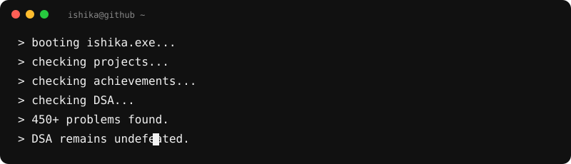
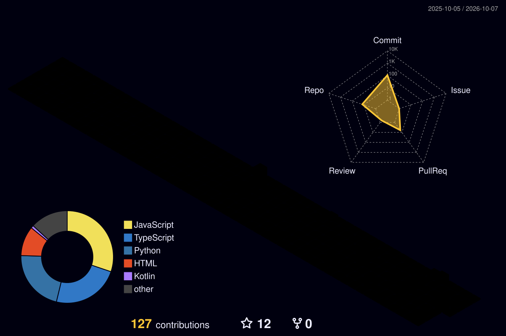

<p align="center">
  
</p>

<div align="center">
  
  <br><br>
  <a href="https://ishika-dumeer.vercel.app/">
    
  </a>
</div>

<p align="center">
  
</p>

<br>

<p align="center">
  
</p>

<br>

## Things I made when "just trying something" got out of hand

<table>
<tr>
<td width="50%" valign="top">

### Awaaj

For someone who can't speak out loud. Reports are hidden  
inside ordinary images using steganography, with AI help  
and a finder for the nearest NGOs, police and shelters.

**Next.js · FastAPI · MongoDB · Groq AI**

[view repository](https://github.com/Ishika1106/Awaaj)

</td>

<td width="50%" valign="top">

### Krishva

A farmer photographs a sick leaf. Krishva names the disease  
and speaks the remedy in Hindi or English.  
15 diseases, 20,000+ training images.

**React · FastAPI · TensorFlow · MobileNetV2**

[view repository](https://github.com/Ishika1106/Krishva)

</td>
</tr>

<tr>
<td width="50%" valign="top">

### Blessings Clinic

A calm, friendly website for a pediatric clinic in Delhi,  
so worried parents can find answers and book a visit  
without any stress.

**React · Firebase · SEO**

[visit live site](https://blessings-clinic.web.app/)

</td>

<td width="50%" valign="top">

### Cedar & Sage

A restaurant web experience built because  
apparently I cannot see a website without redesigning it.

**React · Vite · React Router · CSS**

[live site](https://cedar-sage.vercel.app) · [repository](https://github.com/Ishika1106/Cedar-Sage)

</td>
</tr>
</table>

<p align="center">
  <sub>more of the story (and the animations) on my <a href="https://ishika-dumeer.vercel.app/">portfolio</a></sub>
</p>

<br>

## Trophy shelf

```text
✦ Finalist          Avinya 2026, IIT Guwahati (Team URJA, 2000+ registrations)
✦ Top 10 of ~120    Hardware hackathon, exhibited at "Consciousness Through Science"
✦ Selected          IIM Bangalore Young Leadership Summit, Venix 2026 (30,774 registrations)
✦ Top 1%            IIT Delhi Campus Ambassador, with a Letter of Recommendation
```

<br>

## Tools of the trade

<p>
  
  
  
  
  
  
  
  
  
  
  
  
  
</p>

<br>

## DSA.exe

```text
450+ problems

confidence        ██████░░░░
understanding     ███████░░░
stubbornness      ██████████

status: still fighting
```

### 450+ questions later, I have learned two things:

every problem has a pattern

apparently I have not learned all the patterns

<br>

<div align="center">
  <br>
  <h2>Github, but make it architectural.</h2>

  <picture>
    <source
      media="(prefers-color-scheme: dark)"
      srcset="./profile-3d-contrib/profile-night-rainbow.svg"
    />
    <source
      media="(prefers-color-scheme: light)"
      srcset="./profile-3d-contrib/profile-season.svg"
    />
    
  </picture>

  <p>
    apparently those little green squares were building something.
  </p>
</div>

<br>

## Let's write some code (or just talk about it)

<p>
  <a href="mailto:ishikadumeer@gmail.com">
    
  </a>
  <a href="https://www.linkedin.com/in/ishika-dumeer/">
    
  </a>
  <a href="https://ishika-dumeer.vercel.app/">
    
  </a>
</p>

---

wait.

you actually read all of that?

respect.

<br>

<p align="center">
  <code>&gt; connection closed_</code>
</p>
